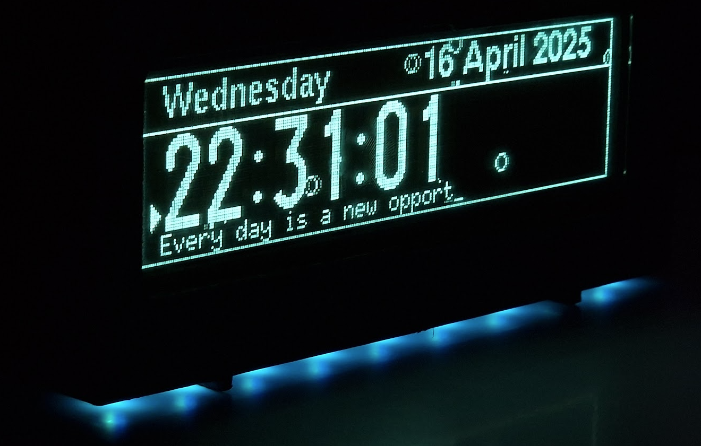
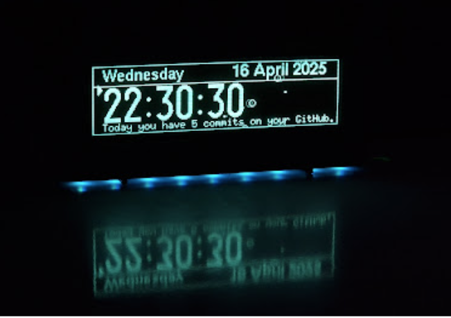
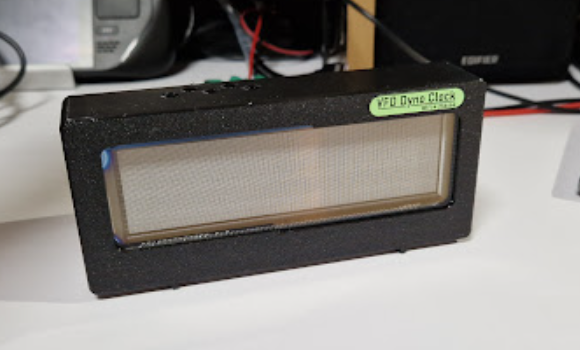

# 🕒 VFD Wi-Fi Clock на ESP32

Інтерактивний годинник на базі великого вакуумно-люмінесцентного дисплея **GP1247AI** (253×63 пікселі) з керуванням через веб-інтерфейс. Реалізовано на платформі **ESP32-WROOM-32D** з використанням **PlatformIO + Visual Studio Code**.

---

## 📸 Фото проекту







⚙️ Технічні характеристики
Мікроконтролер: ESP32-WROOM-32D

Дисплей: GP1247AI (VFD 253x63)

Бібліотека для дисплея: U8g2

Управління: Повністю через веб-інтерфейс

Керування живленням: Кнопка Reset/Config

Живлення: 5-24В (5V 900mA)

Інтерфейс: Wi-Fi

🌐 Веб-інтерфейс
Доступні функції:

⏰ Режим дати та часу (ручний / автоматичний через NTP)

🖼️ Фонова анімація (ввімкнути або обрати іншу)

🌈 Колір і яскравість фонової підсвітки

🌍 Вибір сервера точного часу

🔄 Режим конфігурації
Натисніть та утримуйте кнопку Config

Подайте живлення

З'явиться Wi-Fi точка доступу

Підключіться до неї

Оберіть свою мережу, введіть пароль (за потреби)

Після збереження налаштувань пристрій автоматично перезавантажиться

📁 Структура репозиторію

```markdown

├── include/                # Заголовочні файли
├── lib/                    # Зовнішні бібліотеки
├── src/                    # Основний код прошивки
├── data/                   # Файли для SPIFFS (веб-інтерфейс)
├── pcb/                    # Схеми та плати
├── platformio.ini          # Конфігурація PlatformIO
└── README.md               # Опис проєкту
```

🧪 Статус проєкту
🟡 Розробка триває: реалізовано базову функціональність (відображення часу, веб-інтерфейс, анімації, збереження налаштувань).
📌 Плати та схеми доступні в репозиторії.

🧰 Інструменти
PlatformIO

U8g2 Library

ESPAsyncWebServer

ESPAsyncWiFiManager

📬 Зворотний зв'язок
Бажаєш запропонувати фічу або знайдено баг? Створи Issue або зроби Pull Request! 🤝

📜 Ліцензія
Цей проєкт розповсюджується під GPLv3 License.

Проєкт створено з ❤️ та захопленням до ретро-дисплеїв
